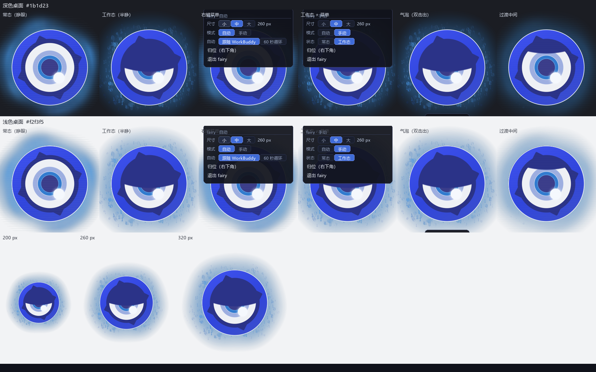
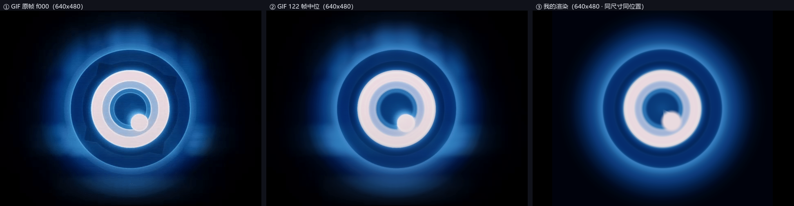
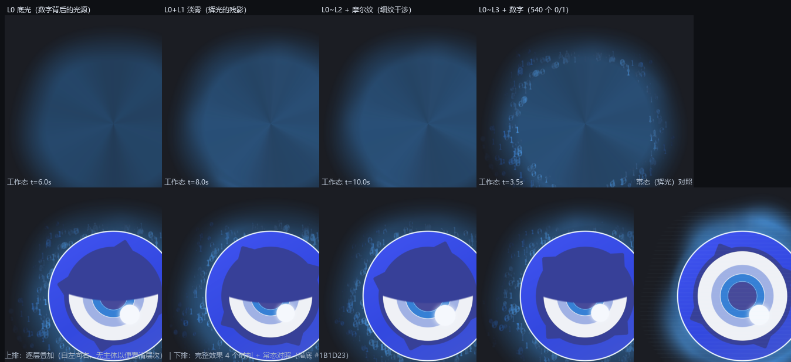
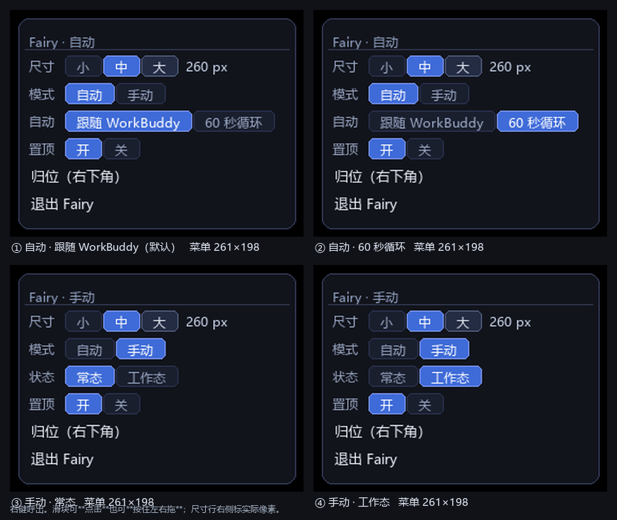
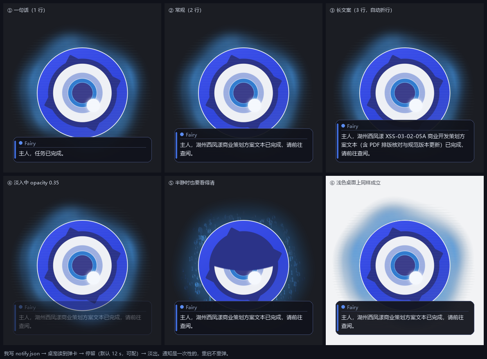

# Fairy · Windows 桌面宠物

把《绝区零》里的 **Fairy** 做成一只真正的桌面挂件：**无边框、逐像素透明、始终置顶、60 fps**。

它的用途只有一个 —— **让"我正在干活"这件事一眼可见**：
干活时它半睁着眼，外圈辉光碎成 **0/1 的数字流**，下面挂一条**进度条**；
活干完了，它弹一张小卡片说「XX 已完成，请前往查阅」。你不需要盯着任何窗口。



> ⚠️ **非官方项目**。角色「Fairy」版权归 **miHoYo（米哈游）** 所有，**仅供个人学习与技术交流，不得商用**。
> 形象、素材与开机动画的完整来源与许可，见 `NOTICE.md`。

---

## 一、它长什么样

| 常态（睁眼） | 工作态（半睁 + 辉光变 0/1 + 进度条） |
|---|---|
|  |  |

<p align="center">
  
  
</p>

---

## 二、快速开始

**环境**：Windows 10 / 11 · **Python 3.10+**（不需要 tkinter、不需要 Qt —— 直接 `ctypes` 调 Win32）

```bat
pip install -r requirements.txt
```

然后**双击 `start_fairy.vbs`**。
（改了代码要重启 → 用 **`restart_fairy.vbs`**：它先结束旧实例再起新的。）

### 首次启动会慢一次，之后秒开

| 阶段 | 说明 |
|---|---|
| ① 倒计时窗 | 第一次要**烘焙图层缓存**，屏幕正中先出现一块倒计时窗（260 px 档约 **100 秒**）。窗口不出来是正常的 |
| ② 开机动画 | 烘完播一遍开机动画 → 主体在屏幕**中央**登场 → 自己走到**主屏右下角** |
| ③ 之后每次 | 缓存命中 ⇒ **约 0.2 s 秒开** |

- 想一次把三档都烘好（约 5~6 分钟）：`python fairy_bake.py 200 260 320`
- **档位是启动时自动测出来的**：小屏 200 / 全高清 260 / 2K+ 320（只认主屏），也可以右键改。
- **高分屏**（系统缩放 ≠ 100%）下画布会按缩放放大 ⇒ 缓存与首烘时长**按画布面积增长**（平方级）。

### 找不到 Python？怀疑没起来？

启动器**不写死任何机器路径**，按六级顺序探测：

```
%FAIRY_PYTHON%  →  同目录 python_path.txt  →  WorkBuddy 托管 venv
                →  其它托管 Python  →  %PATH%  →  常见安装目录
```

所以：**官方安装包 + 勾选 "Add python.exe to PATH" ⇒ 什么都不用配**。
非标准位置（便携版 / 虚拟环境）就在本目录放一个 `python_path.txt`，写一行路径即可：

```
D:\Python311\pythonw.exe
```

> 这个文件已在 `.gitignore` 里，不会跟着提交。

**双击 `check_fairy.vbs`** —— 它会弹窗告诉你结论（进程在不在、窗口可见不可见、最近有没有报错）。

---

## 三、怎么用

### 3.1 右键菜单（分两级：主菜单 = 导航 + 动作，设置进二级页）

| 主菜单 | 说明 |
|---|---|
| **显示 ▸** | 二级页 —— **尺寸**（小 200 / 中 260 / 大 320）、**字体**（中 / 粗 / 特粗，思源黑体） |
| **行为 ▸** | 二级页 —— **模式**（自动 / 手动）、**来源**、**感知**、**状态**、**置顶**、**开机** |
| **播放开机动画** | 立刻播一遍（不影响「开机」那一项的配置） |
| **归位（右下角）** | 找不到它时用这个 |
| **退出 Fairy** | 关掉；下次双击 `.vbs` 再启动 |

- 【行为】页里的 **开机**（播放动画 / 跳过）**改完要重启才生效**。
- 菜单里**悬停 5 秒**会浮出一行说明（纯文字、无底色）。
- 左键拖动可移动；双击它会说一句话。

### 3.2 它只认文件 —— 三个纯文本，不联网、不要权限

| 文件 | 作用 |
|---|---|
| `state.json` | **眼睛**：`{"state":"working","ttl":2700,"note":"…"}` ⇒ 半睁 + 辉光变 0/1；`idle` ⇒ 睁眼。`ttl` 是兜底秒数，防"忘了改回来" |
| `progress.json` | **进度条**：`percent` / `done` / `settle`。只在工作态显示，按**最小 1% 的台阶**往上爬 |
| `notify.json` | **通知卡**：`{"text":"…","secs":12}` ⇒ 弹卡（自动折行、最多 3 行），**读完即删**，不重弹 |

命令行发一句：

```bat
python fairy_notify.py --work "接单：改通知卡圆角"   :: 切工作态（先不出进度条）
python fairy_notify.py --plan 3 "查现状/出候选/落地" :: 拆好步骤 ⇒ 进度条登场
python fairy_notify.py --item 1 2                    :: 第 1 项的第 2 小段完成
python fairy_notify.py --reply "主人，3 项修改已完成。" :: 跑到 100% + 弹完成卡
```

> 不想敲命令行？双击 **`test_notify.vbs`** 就能看到卡片效果。

### 3.3 不碰鼠标的开关

在本目录放一个文件就行：

| 文件 | 作用 |
|---|---|
| `stop.txt` | 让它自己退出（并删掉这个文件）—— 适合写脚本 |
| `poke.txt` | 让它归位并亮出来（**再双击一次启动器也是这个效果**） |

---

## 四、目录结构

```
fairy-desktop-pet/
├── fairy_pet.py           主程序：Win32 分层窗口 + 状态机 + 自绘菜单 + 通知卡 + 进度条
├── fairy_layers.py        实时渲染器：图层预烘 + 相位表查表（60 fps 的关键）
├── dsh_mascot.py          参考渲染器：形象与动效的**唯一真源**（慢，只用来对拍）
├── fairy_digits.py        工作态的 0/1 数字流
├── fairy_bar.py           进度条渲染器（唯一真源）
├── fairy_screen.py        启动时的屏幕测量：数屏 / 定档 / 定位
├── fairy_activity.py      会话活动感知（读会话记录 ⇒ 自动进工作态）
├── fairy_boot.py          开机动画（含首次启动的倒计时窗）
├── fairy_notify.py        命令行发通知 / 改状态 / 报进度的小工具
├── fairy_bake.py          缓存预烘（可一次烘三档）
├── fairy_status.py        一键体检（进程 / 窗口 / 心跳 / 日志）
├── step17_hdd_progress.py 自绘文字与数字的底层（描边 / 发光 / 字距）
├── glow_polar.npz         ★ 辉光的实测数据（从原素材量出来的，运行时必需，别删）
├── boot/                  开机动画素材（原作者见 NOTICE.md §5）
├── fonts/                 思源黑体（OFL 1.1，随包分发）
├── *.vbs / *.bat          启动器与排障工具
├── assets/                形象素材
├── docs/                  设计说明与验收图（images/）
└── tools/                 自测与预览脚本
```

运行时会自动生成（已在 `.gitignore` 里）：
`_cache/*.npz`（预烘缓存，**可删，删了下次重烘**）、`heartbeat.txt`（心跳，**排障第一站**）、
`pet_error.log`（只在出错时写；**程序装了全局异常钩子，未捕获异常只写这里、不上屏**）、
`state.json` / `pos.json` / `progress.json` / `notify.json`。

---

## 五、技术要点（想改代码的话）

这个项目最花时间的不是"画一只猫"，而是**让它 60 fps 跑起来、并且 15 秒无缝循环**：

1. **别照抄帧率**。原素材 GIF 是 30/40 ms 交替（≈29 fps），直接播放就是"不顺滑"的根源；
   本项目走**连续参数化 + 60 fps**，不逐帧播放。
2. **图层预栅格化 + 相位表查表**：把"每帧算一遍"改成"预烘相位帧，运行时查表"，
   单帧从数百毫秒降到 **6~10 ms**。
3. **画布直接用 BGR 通道序存**，省掉每帧一次全幅通道翻转。
4. **绝对时间网格调度**：`next_t += interval`，而不是 `now - last >= interval`
   （后者每帧固定漂移，实测只有 56 fps）；再配 `timeBeginPeriod(1)`，
   否则 sleep 粒度 15.6 ms、直接掉到 30 fps。
5. **准周期闭合**：要"看起来无规律、但首尾帧无缝"，让每个谐波在周期内转**整数圈**。
   **千万别靠删谐波来凑** —— 那会变成 N 重对称，一眼看穿。
6. **光晕不要"建模"，要"照素材量"**：拿原素材量径向剖面 + 角向图案直接照抄；
   自己写公式捏出来的，通常就是一圈很假的实心环。

更完整的设计笔记在 `docs/`：

| 文档 | 内容 |
|---|---|
| `docs/STEP1B_官方源码依据.md` | 形象几何的权威依据（官方 SVG 源码逐项对照） |
| `docs/STEP1_形象实测与对照_说明.md` | 从原素材量出来的实测数据 |
| `docs/STEP2_动效说明.md` | 呼吸 / 睫毛 / 闪烁 / 眼睑的参数与曲线 |
| `docs/STEP3_主程序说明.md` | **主文档**：架构、参数表、全部踩过的坑 |

自带自测工具（`tools/`）：

```bat
python tools\step15_link_test.py      :: 离屏自测：状态机 / 通知 / 超时兜底，不建窗口
python tools\step16_live_test.py      :: 现场联调：对真窗口发信号，用心跳当客观证据
python fairy_pet.py --selftest        :: 不建窗口，报三态耗时（渲染 / 装箱 / 上屏）
python fairy_status.py                :: 一键体检
```

---

## 六、已知限制

- **仅 Windows**：整窗口靠 `UpdateLayeredWindow` + `WS_EX_LAYERED`，没有跨平台抽象层。
- **形象是"重建"不是"导入"**：几何按官方 SVG 源码逐项复刻，所以能实时渲染；
  代价是**与游戏内并非逐像素一致**。
- **光晕是"贴图"不是"物理"**：外圈辉光是照原素材量下来贴的，不是体积光模拟。
- **只落在主屏**，而且不会压到任务栏上；不会跑到副屏去。
- **通知卡是一次性的**：读完即删，不留历史。
- 界面文案里的称呼写死为「主人」；想改就改 `fairy_pet.py` / `fairy_notify.py` 里的字符串。

---

## 七、致谢

这个项目能成立，靠的是几位创作者公开分享的东西 —— **请一并尊重他们的劳动**：

- **米游社 @沝珵** —— 提供了 **Fairy 的 GIF 原图**（`assets/fairy_original.gif`）。
  形象对照、动效量测、外圈辉光的形状与配色，全部是从这张 GIF 里量出来的。
- **B站 @橙汁本色** —— 开源了 **`Chengzhibense/Fairy-DSH`** 仓库，并发布视频
  **《可能是全网最还原的Fairy（动画）》**。那个仓库里有**官方 mascot 的 SVG/JS 源码**，
  本项目的形象是**严格按它的几何逐项重建**的 —— 这是"像"的根本原因。
- **B站 @玉偶青衣** —— 提供了**开机动画素材**（本项目 `boot/` 下的两个文件由它转出）。
  原视频：<https://www.bilibili.com/video/BV1V6bG6vEmh/>

> 也感谢《绝区零》与 miHoYo 创造了这个角色。

---

## 八、许可

- **本项目代码**：**Apache License 2.0**（见 `LICENSE`）—— 与上游 `Chengzhibense/Fairy-DSH` 一致。
- **形象与素材**：版权归 **miHoYo（米哈游）** 所有；GIF 由 **米游社 @沝珵** 提供；
  开机动画素材版权归 **B站 @玉偶青衣**。**仅供学习交流，请勿商用。**
- 详细的来源与归属声明见 **`NOTICE.md`**。
